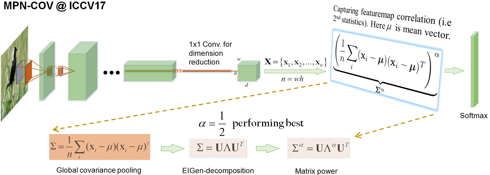

# Is Second-order Information Helpful for Large-scale Visual Recognition?

Created by [Jiangtao Xie](http://jiangtaoxie.github.io) and [Peihua Li](http://www.peihuali.org)
<div>
&emsp;&emsp;&emsp;&emsp;&emsp;&emsp;
</div>

## Contents
0. [Introduction](#introduction)
0. [Classification results](#classification-results)
0. [Implementation details](#implementation-details)
0. [Installation](#installation)
0. [Usage](#usage)
0. [Change log](#change-log)
0. [Other Implementations](#other-implementations)
0. [References](#references)
0. [Contact](#contact)

## Introduction

This repository contains the source code and models trained on ImageNet 2012 dataset for the following paper:

    @article{Li2017,
        author = {Peihua Li,Jiangtao Xie,Qilong Wang and Wangmeng Zuo},
        title  = {Is Second-order Information Helpful for Large-scale Visual Recognition?},
        journal= {International Conference on Computer Vision (ICCV)},
        year   = {2017}
    }

We proposed the second-order pooling to replace the common first-order, max/average pooling after the last conv. layer. The proposed networks, called MPN-COV ConvNets, achieved consistent, nontrivial improvements over their counterparts. The key to our method is **Matrix Power Normalization of COVariance**, which

1. amounts to robust covariance estimation given a small number of large-dimensional features(a.k.a. small sample/large dimension), as commonly seen in the last convolutional layers in state-of-the-art ConvNets;
2. appropriately exploits Riemannian geometry which allows zero eigenvalues, overcoming the downside of the well-known Log-Euclidean metric in this scenario.


   
   - Figure 1: Error(%,10-crop) comparison of MPN-COV ConvNets with the counterparts. We can see our method can improve the performance of top-1 1.6% ~ 6.8%,and top-5 1.0% ~ 4.0%.

You can visit our [project page](http://peihuali.org/iSQRT-COV/index.html) for more details.
## Classification results

### Classification results(top-1/top-5 error rates, %) on ImageNet 2012 validation set

 Network            |224x224<br />1-crop|224x224<br />10-crop|GoogleDrive|BaiduCloud
 ---|:---:|:---:|:---:|:---:
 MPN-COV-ResNet-50 |22.27/6.35         |21.16/5.58     |[186.8MB](https://drive.google.com/open?id=0B-bKYQs6Xic1TnZ5ZS1JRlVVZGM)|[186.8MB](https://pan.baidu.com/s/1c2fG1S8)
 MPN-COV-ResNet-101 |21.17/5.70        |19.71/5.01     |[270.7MB](https://drive.google.com/open?id=0B-bKYQs6Xic1bzVDN3EyaVZ4eGs)|[270.7MB](https://pan.baidu.com/s/1hsgonTq)
 MPN-COV-AlexNet |38.37/17.14          |34.97/14.60    |[567.0MB](https://drive.google.com/open?id=0B-bKYQs6Xic1ZDJBNllxSXFDamc)|[567.0MB](https://pan.baidu.com/s/1boUndMn)
 MPN-COV-VGG-M   |34.63/14.64          |31.81/12.52    |[581.6MB](https://drive.google.com/open?id=0B-bKYQs6Xic1SmJmQkRjV1NGUWs)|[581.6MB](https://pan.baidu.com/s/1o8QJmgM)
 MPN-COV-VGG-16  |26.55/8.94           |24.68/7.75     |[614.0MB](https://drive.google.com/open?id=0B-bKYQs6Xic1Rjl2VnlWbVNEUWM)|[614.0MB](https://pan.baidu.com/s/1c2csEsC)

  - The results and models above are obtained by training from scratch (random initialization), and the code is released [here](https://github.com/jiangtaoxie/MPN-COV-ConvNet/tree/master/examples/imagenet).
  - The results will improve with warm initialization, for example, MPN-COV-AlexNet achieved top-1/top-5 error rates(%) 37.35/16.60 and MPN-COV-VGG-M achieved 33.44/13.61 when using 1-crop prediction.
  - The two models, i.e., MPN-COV-ResNet-50 and MPN-COV-AlexNet, we released here are trained with the same settings,  slightly better than the models we reported in the ICCV paper.
  - The results either 1-crop or 10-crop  are evaluated using our [code](https://github.com/jiangtaoxie/MPN-COV-ConvNet/tree/master/examples/evaluate), Note that the main difference from the code provided by MatConvNet is that we RESIZE an image using Matlab [imresize function](http://cn.mathworks.com/help/images/ref/imresize.html); the performance will decrease slightly if the resize function of MatConvNet is used.


## Implementation details

We developed our programs based on [MatConvNet](http://www.vlfeat.org/matconvnet) and Matlab 2015b, running under either Ubuntu 14.04.5 LTS and Windows 7. To implement MPN-COV layer, we adopt the [eigenvalue decomposition](https://en.wikipedia.org/wiki/Eigendecomposition_of_a_matrix) algorithm on CPU in single-precision format, as its GPU version on the CUDA platform is much slower. Except for eigenvalue decomposition, all other operations in forward and backward propagations are performed using C++ on GPU. While writing code, we follow the convention of MatConvNet as closely as possible.


### Created and Modified

1. Files we created to implement MPN-COV layer

```
└── matconvnet_root_dir
    └── matlab
        ├── src
        │   ├── bits
        │   │   ├── impl
        │   │   │   ├── blashelper_cpu.hpp
        │   │   │   ├── blashelper_gpu.hpp
        │   │   │   ├── mpn_cov_cpu.cpp
        │   │   │   ├── mpn_cov_gpu.cu
        │   │   │   └── nnmpn_cov_blas.hpp
        │   │   ├── nnmpn_cov.cpp
        │   │   ├── nnmpn_cov.cu
        │   │   └── nnmpn_cov.hpp
        │   ├── vl_nnmpn_cov.cpp
        │   └── vl_nnmpn_cov.cu
        ├── +dagnn
        │   └── MPN_COV_Pool_C.m
        └── EIG.m
```

- We use [mexCallMATLAB](http://cn.mathworks.com/help/matlab/apiref/mexcallmatlab.html) to call Matlab built-in [eig function](https://cn.mathworks.com/help/symbolic/eig.html?s_tid=srchtitle) in our C/C++ mexFunction file. Actually, we write a matlab function called `EIG.m` performing eigenvalue decomposition of a batch of covariance matrices.

- `MPN_COV_Pool_C.m` is object oriented, enabling adding the layer of MPN-COV when the wrapper of DagNN is used.

2. Files we modified to support MPN-COV layer

```
└── matconvnet_root_dir
    └── matlab
        ├── vl_compilenn.m
        └── simplenn
            └── vl_simplenn.m
```
- We modified `vl_compilenn.m` so that our MPN-COV code can be complied, and modified `vl_simplenn.m` to support the layer interface when the wrapper of SimpleNN is used.

## Installation

1. We package our programs and [demos](https://github.com/jiangtaoxie/MPN-COV-ConvNet/tree/master/examples/imagenet) in MatConvNet toolkit,you can download this [PACKAGE](https://github.com/jiangtaoxie/MPN-COV-ConvNet/archive/master.zip) directly, or in your Terminal type:

```
   >> git clone https://github.com/jiangtaoxie/MPN-COV

```

2. Then you can follow the tutorial of MatConvNet's [installation guide](http://www.vlfeat.org/matconvnet/install/) to complile, for example:

```matlab
   >> vl_compilenn('enableGpu', true, ...
                   'cudaRoot', '/Developer/NVIDIA/CUDA-8.0', ...
                   'cudaMethod', 'nvcc', ...
                   'enableCudnn', true, ...
                   'cudnnRoot', 'local/cudnn-rc4') ;

```
3. Currently, we use MatConvNet 1.0-beta22. For newer versions, please consult the MatConvNet [website](http://www.vlfeat.org/matconvnet).


## Usage


### Insert MPN-COV layer into your network

1. Under SimpleNN Framework

```matlab
   net.layers{end+1} = struct('type','mpn_cov',...
                              'name','mpn_cov_pool',...
                              'method',[],...
                              'regu_method','power',...
                              'alpha', 0.5,...
                              'epsilon', 0);
```

2. Under DagNN Framework

```matlab
   name = 'mpn_cov_pool';
   net.addLayer(name , ...
                dagnn.MPN_COV_Pool_C('method', [],...
                                    'regu_method', 'power', ...  
                                    'alpha', 0.5,...
                                    'epsilon', 0), ...
                                    lastAdded.var, ...
                                    {name, [name, '_aux_S'], [name, '_aux_V'],[name,'_aux_D']});
   lastAdded.var = name;
```

   In our [demo](https://github.com/jiangtaoxie/demo/tree/master/imagenet) code, we implement MPN-COV AlexNet, VGG-M and VGG-VD under SimpleNN framework, and MPN-COV ResNet under DagNN framework.

###  Arguments descriptions

1. **`'method'`**: It is reserved for future use.
2. **`'regu_method'`**: We introduced three normalization methods in the paper, namely, `MPN-COV`,`MPN-COV+matrix-l2`,`MPN-COV+matrix-Fro`. As the latter two normalizations produced unsatisfactory performance, we only support MPN-COV, designated by `'power'`.
3. **`'alpha'`**: It denotes the exponent of matrix power function(equivalently, the power of eigenvalues, see the paper), whose values should be positive. The default value is 0.5 producing the best performance.
4. **`'epsilon'`**: It is a small positive number added to eigenvalues of covariance matrices. It is set to 0 as the Power-E metric allows the eigenvalue to be non-negative.

## Change log


## Other Implementations

0. [Caffe Implementation](link)(Coming soon)
0. [TensorFlow Implemention](link)(Coming soon)

## References

##### [1] C. Ionescu, O. Vantzos, and C. Sminchisescu. Matrix backpropagation for deep networks with structured layers. In ICCV, 2015.


## Contact

**If you have any questions or suggestions, please contact us**

`jiangtaoxie@mail.dlut.edu.cn`
